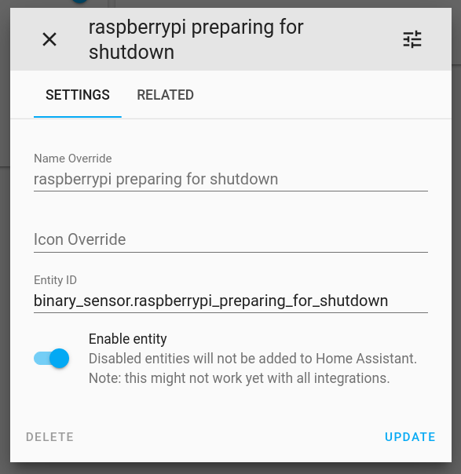

# systemctl-mqtt

[](https://github.com/psf/black)
[](https://github.com/fphammerle/systemctl-mqtt/actions)
[](https://coveralls.io/github/fphammerle/systemctl-mqtt?branch=master)
[](https://pypi.org/project/systemctl-mqtt/#history)
[](https://pypi.org/project/systemctl-mqtt/)
[](https://zenodo.org/badge/latestdoi/272405671)

MQTT client triggering & reporting shutdown on [systemd](https://freedesktop.org/wiki/Software/systemd/)-based systems

## Setup

```sh
$ pip3 install --user --upgrade systemctl-mqtt
$ systemctl-mqtt --mqtt-host HOSTNAME_OR_IP_ADDRESS
```

On debian-based systems, dependencies can optionally be installed via:
```sh
$ sudo apt-get install --no-install-recommends python3-dbus python3-gi python3-paho-mqtt
```

Schedule poweroff by sending a MQTT message to topic `systemctl/hostname/poweroff`.

```sh
$ mosquitto_pub -h MQTT_BROKER -t systemctl/hostname/poweroff -n
```

Lock screen by sending a MQTT message to topic `systemctl/hostname/lock-all-sessions`.

```
$ mosquitto_pub -h MQTT_BROKER -t systemctl/hostname/lock-all-sessions -n
```

### Shutdown Report

`systemctl-mqtt` subscribes to [logind](https://freedesktop.org/wiki/Software/systemd/logind/)'s `PrepareForShutdown` signal.

`systemctl halt|poweroff|reboot` triggers a message with payload `true` on topic `systemctl/hostname/preparing-for-shutdown`.

## Home Assistant 🏡

### Sample Setup

#### Send Poweroff Command

```yaml
# https://www.home-assistant.io/docs/mqtt/broker/#configuration-variables
mqtt:
  broker: BROKER_HOSTNAME_OR_IP_ADDRESS
  # credentials, additional options…

script:
  poweroff_raspberry_pi:
    sequence:
      service: mqtt.publish
      data:
        topic: systemctl/raspberrypi/poweroff

homeassistant:
  customize:
    script.poweroff_raspberry_pi:
      friendly_name: poweroff pi
      icon: mdi:power
```

#### Trigger Automation on Shutdown

```yaml
automation:
- trigger:
    platform: mqtt
    topic: systemctl/raspberrypi/preparing-for-shutdown
    payload: 'true'
  action:
    service: switch.turn_off
    entity_id: switch.desk_lamp
```

### Automatic Discovery of Shutdown Sensor (Optional)

After enabling [MQTT device discovery](https://www.home-assistant.io/docs/mqtt/discovery/)
home assistant will automatically detect a new entity
`binary_sensor.hostname_preparing_for_shutdown`.

```yaml
mqtt:
  broker: BROKER_HOSTNAME_OR_IP_ADDRESS
  discovery: true # default in home assistant >=v0.117.0
  # credentials, additional options…
```



When using a custom `discovery_prefix`
pass `--homeassistant-discovery-prefix custom-prefix` to `systemctl-mqtt`.

## Docker 🐳

1. Clone this repository.
2. Edit `docker-compose.yml`.
3. Load [AppArmor](https://en.wikipedia.org/wiki/AppArmor) profile:
   `sudo apparmor_parser ./docker-apparmor-profile`
4. `sudo docker-compose up --build`

Pre-built docker image are available at https://hub.docker.com/r/fphammerle/systemctl-mqtt/tags

Annotation of signed tags `docker/*` contains docker image digests: https://github.com/fphammerle/systemctl-mqtt/tags

## MQTT via TLS

TLS is enabled by default.
Run `systemctl-mqtt --mqtt-disable-tls …` to disable TLS.

## MQTT Authentication

```sh
systemctl-mqtt --mqtt-username me --mqtt-password secret …
# or
systemctl-mqtt --mqtt-username me --mqtt-password-file /var/lib/secrets/mqtt/password …
```

## Adapt Poweroff Delay

```sh
systemctl-mqtt --poweroff-delay-seconds 60 …
```
